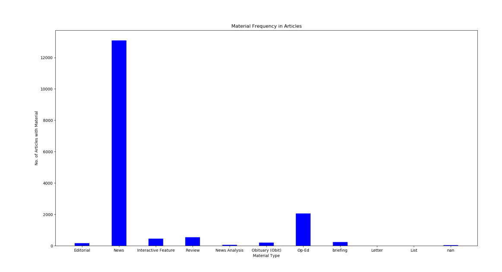
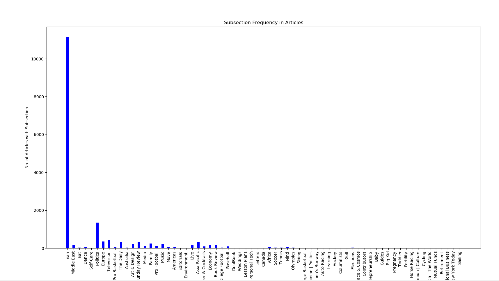
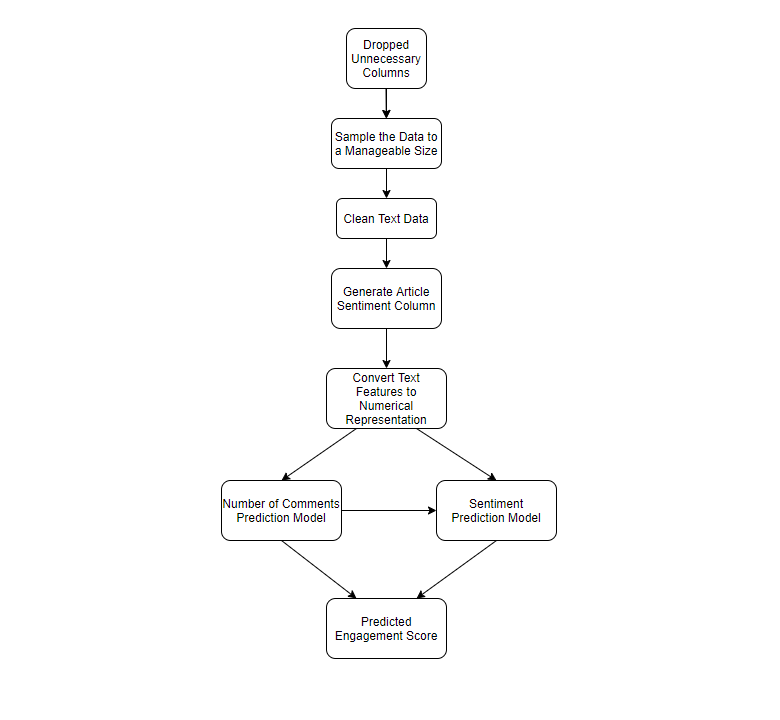
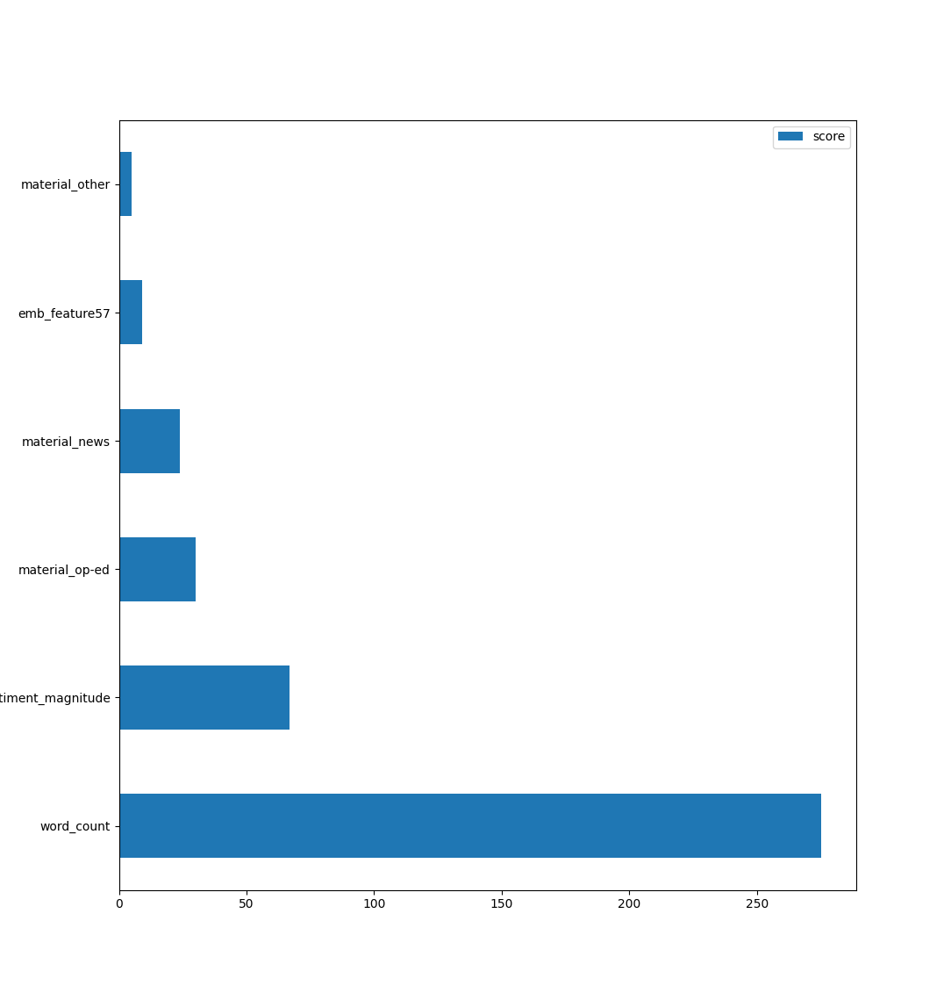
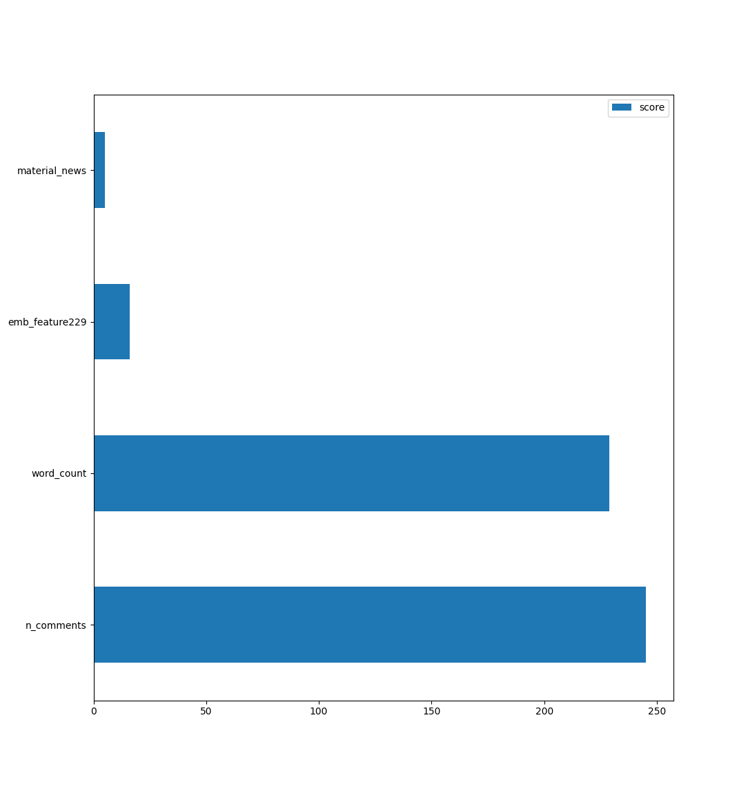

# Introduction:

The New York Times is an American newspaper that is widely regarded as one of the popular and well-established news sources in the world. Over the past few years, user engagement has steadily grown leading to stronger online opinions as well as the need to classify and measure the sort of engagement on articles. By predicting the public response, the newspaper can give more targeted articles which will draw in more readers and keep the public well informed and engaged about critical current events in the world. To do so, we will use an open-source dataset of 16,000 New York Times articles and 5 million corresponding comments, with over 30 features to examine. 

# Problem Definition:

Given various features of a New York Times article as inputs, the goal of our project is to generate an overall **engagement metric**. This engagement metric can provide editors with necessary insight and feedback on their writing to gauge the audience reaction before they publicly publish their article.

* Article Features: headline, article newsdesk, article section, article length, keywords, abstract, etc
* Output of the first model: Number of comments for the article 
* Output of the second model: Forecasted average sentiment magnitude
* Final output: Engagement metric (calculated through a weighted sum of the number of comments and the magnitude of the sentiment that the article is forecasted to receive)

# Data
The actual dataset can be downloaded from Kaggle (https://www.kaggle.com/benjaminawd/new-york-times-articles-comments-2020), and we demonstrated the main part of our preprocessing model in the preprocessing section below. These are two CSV files from Kaggle, articles.csv and comments.csv. These are linked through unique IDs which correspond to the info about articles and the individual comments corresponding to each comment. 
* Article columns - newsdesk, section, subsection, material, headline, abstract, keyword, word count, publish date, number comments, link ID
* Comment columns - comment ID, status, user ID, flagged, trusted, comment body, link ID

# Project Flow / Methods
## Preprocessing

:heavy_check_mark:**Data Cleaning:**
* Removing incomplete features that don’t have data points for every column
* Trim whitespace on raw text
* Expand contractions and similar constructs 
* Lowercase all text, remove non-English characters 
* Convert English number words to actual numbers 
* Remove stopwords and words of length <= 2

:heavy_check_mark:**Feature Engineering:**
Drop appropriate columns from each CSV with justification
* Article Columns Drop Justification
  * Newsdesk = Section column is a greater encompassing feature for the article’s area
  * Material = Drop every row of Material that has one of these: `['Interactive Feature', 'Obituary (Obit)', 'briefing', 'Letter']` as these are not news articles intended for engagement prediction
  * Keywords = The abstract is better suited for an NLP model to extract useful information rather than uncontextualized keywords
  * Publication Date = If we are looking to gain insight on an article about to be published, the date of past articles will not help us because we cannot use the date to understand why an article had a certain sentiment since we don’t know what events occurred around that date.
* Comment Columns Drop Justification
  * Drop everything except comment body and link ID. We only need to have the comment content as well as the corresponding article to generate a sentiment value based on the comment text. The link ID will not be used in actually building the model, but only for linking an article with its corresponding comments. 
Additionally, we want to convert our text-based features to numerical representations for the model to use. To do this, we represent the “material” feature using one-hot encoding. We first condense the material section into 3 main categories: News, Op-Ed, and Other (since the other remaining material sections have very few entries). When doing this, we add 3 new columns to the article data.

  * For example, the frequencies of the "material" section shown in the first graph below indicates that the non News/Op-Ed articles are very low in frequency and thus were combined into a new material type. Similarly, the subsection column had more than half the articles with null values, and thus the column was dropped due to its insignificance.

:heavy_check_mark:**Generation of Sentiment Features:**
We ran a sentiment analysis model that will generate the sentiment column in the articles dataset based on each comment body (in comments dataset). A [transformers sentiment model](https://huggingface.co/transformers/) was used for each comment row with the comment text as input features. This is a very simple model which  returns a single value per column row  gauging the sentiment feeling of each comment. A new column “average comment sentiment” was added in the article dataset, which for each article, represents the average of all sentiment values for the corresponding comments. This average comment sentiment column was scaled from -1 to 1 around an average of 0 for consistency across articles. 

:heavy_check_mark:**Converting Comments to a Numerical Representation using Word Embedding**
With this section, we want to add numerical features which represent the context of a given article. This is so that for later models, we don’t have to train on both text and numerical features, but can instead train on the existing numerical features such as word count as well as the added numerical embedded features. To do this, we use a transformer model which takes in the two text features ‘headline’ and ‘abstract’ and outputs a vector of 768 features representing this text. This was accomplished using a [sentence transformer framework](https://www.sbert.net/docs/quickstart.html), Sentence-BERT, that uses the DistilBERT-base-uncased model that comes pretrained on a large dataset of sentences. Average pooling was performed to provide a vector of 768 word embeddings for a sentence of any size. Thus, each article in the article dataset will now have 768 more numerical features or columns.

:heavy_check_mark:**Datasets after preprocessing and adding the sentiment features:**
All of the preprocessing steps are robust in that they help standardize the dataset by removing or modifying anomalies (converting all numbers to digit form, removing non-English characters, removing less relevant words). By dropping features that are not directly relevant to the problem and sanitizing the dataset, we can ensure our model can make more useful predictions. A short example of our preprocessing capability is the input sentence:

> "Thirty white horses, on a red hill. First they champ, then they stamp, then they stand still."

After preprocessing, it becomes:

> "30 white horses red hill first champ stamp stand still"

which is more semantically useful for our model. When all these preprocessing measures were applied on the full dataset, articles.csv and comments.csv were reduced to:

[`nyt-articles-2020-final-dataset.csv`](https://drive.google.com/file/d/1S2wB77Xs9i4D7ABly4Q7gDEGjmDEQ6yh/view)

[`nyt-comments-2020-dropped-sample-cleaned-sentiment.csv`](https://drive.google.com/file/d/1VUxMTKd7UgP-4SXd0T1vjqywWKWMuxEh/view)

## Prediction of Number of Words and Sentiment ##
**Workflow Diagram:**
The data processing and prediction pipeline is shown below to better illustrate the steps taken to reach our predictions.\

**Number of Comments Model:**
 The goal of this model is to train on existing articles with every single numerical feature in order to predict the number of comments. These features include word count, average sentiment, the 768 features from word embedding, and the one hot encoding for material. The type of model used was an extreme gradient boost decision tree ([XGBoost](https://xgboost.readthedocs.io/en/latest/)) with 70% train data, 15% validation, and 15% test. We use [Bayesian hyperparameter optimization](https://optuna.readthedocs.io/en/stable/) for number of estimators, max depth, and learning rate. We can use this tuned model to predict the number of comments for a given article with all these input features. 

**Sentiment Prediction Model:**
The goal and structure of the sentiment prediction model is very similar to the number of comments model. Once again, we train on the existing articles with all the numerical features but this time to predict the sentiment response. We once again use an XGBoost model with similar data divisions along with hyperparameter optimization. However, the difference is that there is an additional input feature column number of comments which we are also using to train sentiment on.  

**Engagement Metric Calculation:**
Note that at this stage, we are equipped to be given a new article with a headline and abstract and run these series of models to predict user response. We can use the number of comments model to in turn train the sentiment prediction model, which will give us a sentiment value which is an estimate of how the target audience will view the article. A final engagement metric column will then be calculated based on the number of comments and predicted sentiment value which is the final indicator of the success of an article meant to be tested on. 

# Results:
After the entire process is complete, we end up with a newly calculated Engagement Metric for each article. This number represents how much traction each article generates. When we want to take a new unpublished article and determine what its engagement might be, we use our 2 models and newly generated columns to predict the number of comments and the sentiment of the article.  

**Number of Comments Model:**
We will break down the trained XGBoost model results into four major points. 
1) When trained on the dataset with no hyperparameter optimization and default params of (n_estimators = 100, max_depth= 6, learning_rate: 0.01), the MSE for the testing data portion is 173802.452 (percent error is 14.40%). 

2) When trained with Bayesian hyperparameter optimization, the optimal parameters were (n_estimators = 80, max_depth= 10, learning_rate: 0.025968120043171675), resulting in an improved MSE of 171335.70 (percent error 14.19%), or an improvement of 1.41928% in MSE using hyperparameters. 

3) Note that the model's ability is obviously best shown by it performing on a sample article with input parameters, and seeing how many comments it outputs. To keep this consistent, we will have one article with the following input features and pass it into both these models as well as the final engagement metric calculation to show how both models combine to provide estimated feedback. Our example article will have  
* Material type = News
* Word count = 1107
* Headline = 'Mom and Dad Are Fighting’: Left-Wing Democrats Lament Sanders-Warren Rift'
* Abstract = 'The sudden breach between the two leading liberals in the Democratic primary race has disheartened those who fear it could provide an advantage to the party’s moderate candidates.'  
The tuned XGBoost model with the optimal parameters predicts the number of comments for this article as 157. 

The graph below shows the feature importances of the number of comments model. As is visible, the sentiment magnitude of the article and the word count of the article are the most important features in predicting the number of comments. The features material_op-ed and material_news are also important features in the model, and they represent articles that are classified as either "News" or "Op-Ed"s by the New York Times. It's also visible that emb_feature57, which is one of the 768 word embeddings, is one of the less important features for the number of comments model. 

The 3D graph below shows the varying accuracies of the number of comments model as its hyperparameters were tuned. Two of the most significant tuned hyperparameters are plotted below, the # of estimators and the max depth of the XGBoost model. Over the optimization process, which was allocated 10 minutes to optimize the hyperparameters, given various pairs of tested values for those 2 parameters, their corresponding mean squared error values have been plotted. 

**Sentiment Prediction Model:**
Once again, break down the trained model into similar 4 points. 
1) When trained on the dataset(including predicted number of comments) with no hyperparameter optimization and default params of (n_estimators = 100, max_depth= 6, learning_rate: 0.01), the MSE for the testing data portion is 0.23(percent error is 11.5%). 

2) When trained with Bayesian hyperparameter optimization, the optimal parameters were (n_estimators = 200, max_depth= 4, learning_rate: 0.09111868005033476), resulting in an improved MSE of 0.20(percent error 10%), or an improvement of 15% in MSE using hyperparameters. 

3) We will continue from the sample political article from the previous section. Passing this in along with the number of comments predicted of 157 gives a predicted sentiment of 0.0185 .

The graph below shows the feature importances of the sentiment prediction model. As is visible, the number of comments of the article and the word count of the article are the most important features in predicting the number of comments. Note that number of words still is a very clear defining feature, but it is interesting that the predicted number of comments feature from the past model actually surpasses it in terms of importance. 

The 3D graph below shows the varying accuracies of the sentiment prediction model as its hyperparameters were tuned. Two of the most significant tuned hyperparameters are plotted below, the # of estimators and the max depth of the XGBoost model. Over the optimization process, which was allocated 10 minutes to optimize the hyperparameters, given various pairs of tested values for those 2 parameters, their corresponding mean squared error values have been plotted. 

**Engagement Metric Calculation:**
The engagement metric is the final qualitative result intended for the New York Times writers which allows insight into how successful and well received an article is. Obviously, the basis for such a metric would be the public reviewal(number of comments), as well as the general tone of such reviews or articles(sentiment). Thus, the engagement metric calculation is given to the number of comments predicted multiplied by the predicted sentiment of such a model. Note that this final engagement metric is simply a combination of both our XGBoost model predictions. For our main article example, the final article engagement metric is calculated to thus be 157 x 0.0185 = 2.9045. For a side by side comparison of our final product, run another sample article with the following criteria to see how it compares. This new article will have the fields  
* Material type = News
* Word count = 1010
* Headline = 'Dear Jets: There's Hope to Be Found in a Winless Season. Take It From Someone Who Knows.'
* Abstract = 'For one thing, you are leading the race for the top draft pick. But seriously, even finishing at 0-16 can yield valuable resilience. So says Hue Jackson, who coached the winless 2017 Cleveland Browns.'
The model's ouptut predicted there to be 12 comments, predicted sentiment to be 0.179, so the final engagement metric as 2.1700. Note that this sample article has a slightly lower expected engagement response than the political article. 

# Discussion:

By analyzing and predicting the number of comments anticipated for an article, the publishers can determine the level of public interest in a given topic and can choose to follow up with corresponding related articles. Additionally, the sentiment analysis allows  the editors to determine how polarizing an article is, and potentially provide items such as blog posts to provide a forum for further public discussion. Low sentiment can tell the editor that perhaps the article should be revised to make it more engaging.

# Conclusions:

Through the course of this project, we have used transformers models as well as two XGBoost models in order to attempt to accurately predict viewer engagement for any given article with a header and abstract. This tool would be incredibly useful for not only New York Times, but theoretically any other newspaper in order to determine which target articles would bring the most success. By passing articles through the pipeline described in the project above, and validifying the models do indeed predict engagement with acceptable loss as shown in results, we have effectively created a way for NYT to visualize response to articles before publishing. 

# Contributions:
* Ashish - preprocessed data, constructed whole preprocessing/data pipeline and streamlined it for efficiency
* Varun - built the two XGBoost models and did preprocessing using ML, provided ideas for data preprocessing
* Sharath - preprocessed all data, did background research about the problem
* Nishant - created word embeddings for all textual data, helped develop data pipeline for preprocessing + ML models
* Yash - provided ideas for data preprocessing, created data visualizations, identified background research about the dataset and which features to use

# References:

Tsagkias, M., Weerkamp, W., & De Rijke, M. (2009, November). Predicting the volume of comments on online news stories. In Proceedings of the 18th ACM conference on Information and knowledge management (pp. 1765-1768).

Schumaker, R. P., Zhang, Y., Huang, C. N., & Chen, H. (2012). Evaluating sentiment in financial news articles. Decision Support Systems, 53(3), 458-464.

Althaus, S. L., & Tewksbury, D. (2002). Agenda Setting and the “New” News: Patterns of Issue Importance Among Readers of the Paper and Online Versions of the New York Times. Communication Research, 29(2), 180–207. https://doi.org/10.1177/0093650202029002004
